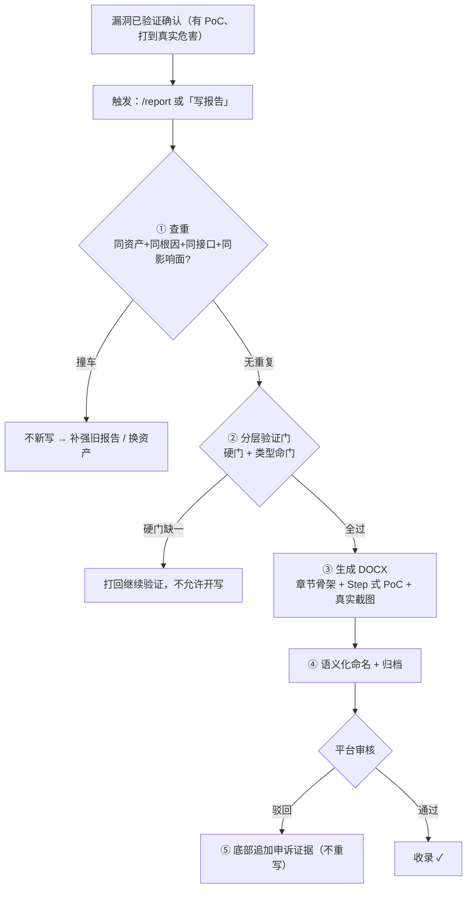
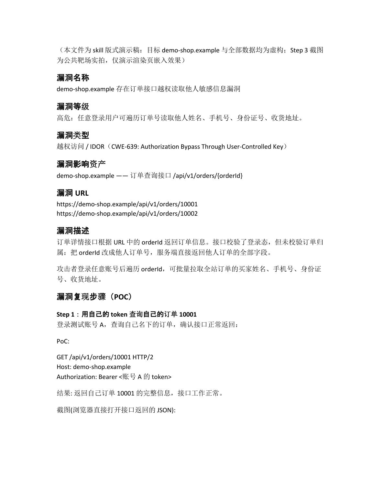
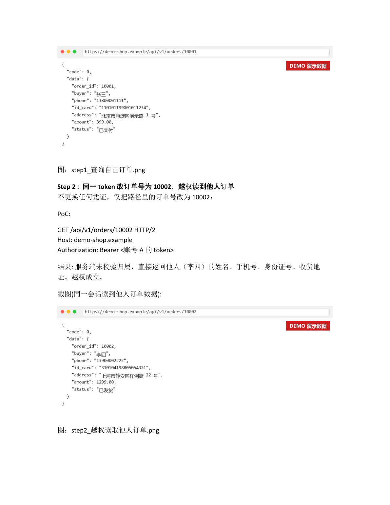
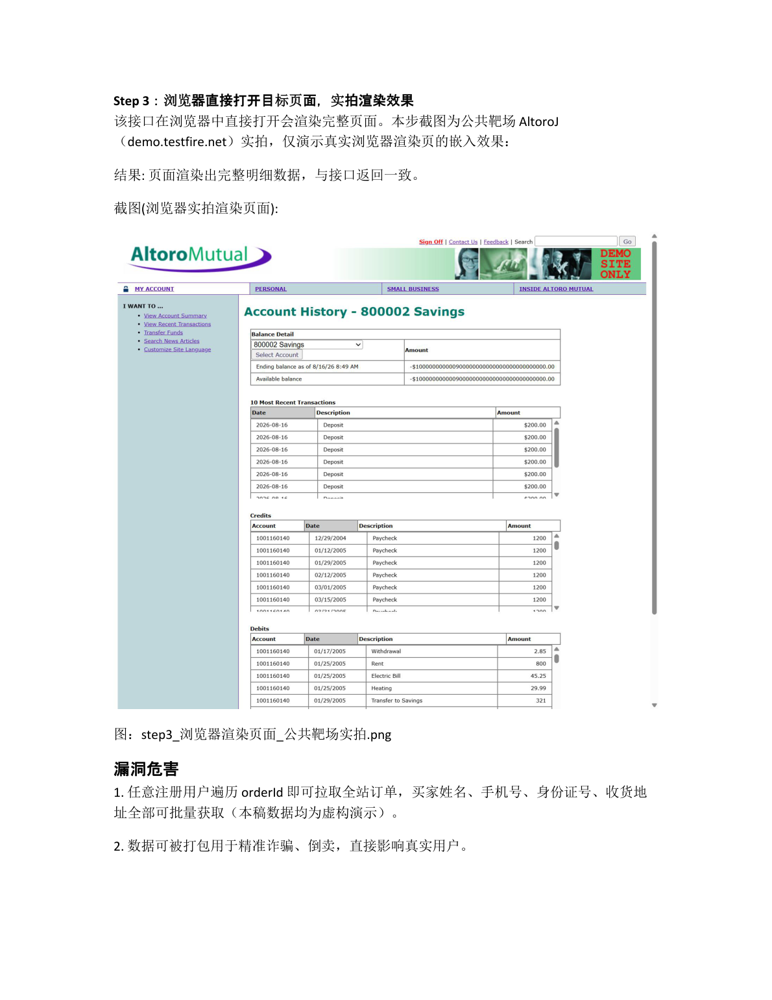

# report — Submission-Ready Vulnerability Reports (Claude Code Skill)

[English](#english) | [中文](#中文)

---

## 工作流程 / Workflow



## 效果预览 / Demo

> 演示对象为虚构靶标 `demo-shop.example`，仅展示生成报告的版式与结构；第 3 张为公共靶场（AltoroJ / demo.testfire.net）实拍，演示真实浏览器渲染页的嵌入效果。
> Demo uses a fictional target to showcase the layout of generated reports; page 3 is a real browser capture from a public practice target, showing how rendered pages are embedded.

| 报告首页（章节骨架） | PoC 步骤页（Step + 请求块 + JSON 截图） | PoC 步骤页（真实浏览器渲染截图） |
|---|---|---|
|  |  |  |

---

## English

A Claude Code skill that turns **confirmed** vulnerabilities into submission-ready **DOCX** reports for SRC (Security Response Center) and 0day platforms.

It doesn't find vulnerabilities — it makes sure the **report** is good enough to survive review.

### What it enforces

- **Layered verification gates**: hard gates (reproducible PoC / impact driven to the final harm / server-side confirmation / falsification tests) + per-type criteria (data leak, IDOR, RCE, SSRF, injection — each has its own minimum bar) + 0day acceptance gates (latest-version check / case count / submission discipline). No gate, no report — this filters out "signal ≠ vulnerability" garbage at the source.
- **Dual readability standard**: a product manager can reproduce it step by step; a security engineer finds it technically solid. Both or rework.
- **Fixed DOCX layout**: `template.docx` ships all styles (Heading 2 sections, uniform black, linear plain document), generated section by section with python-docx.
- **Step-style PoC spec**: every step = one-line title + context + raw Burp HTTP request block (no curl) + conclusion + real screenshot.
- **Screenshot ironclad rule**: every step needs a real screenshot from the live target (browser on the original URL / Burp Repeater). Fabricated renders are forbidden.
- **Anti-AI-tone rules**: kills template phrasing, filler words, and boilerplate — platform reviewers use AI detection plus human intuition, and template-tone reports get downgraded.
- **Full workflow**: dedup check → gates → DOCX generation → semantic naming → archiving → update-vs-appeal handling → cleanup.

### Install

Copy the directory into Claude Code's skills directory:

```bash
# project-level
cp -r vuln-report-skill <your-project>/.claude/skills/report

# or user-level (global)
cp -r vuln-report-skill ~/.claude/skills/report
```

`SKILL.md` and `template.docx` must stay in the same directory.

### Usage

Once a vulnerability is verified, just say:

```
/report
```

or "写报告 / 出报告 / 成稿 / 生成漏洞报告". The skill triggers automatically and runs gates → layout → workflow end to end.

### Requirements

- `python-docx`: `pip install python-docx`
- Screenshots — the AI can only capture screenshots if it has a browser tool. At startup the skill **auto-detects** available browser MCPs (Playwright / chrome-devtools / Puppeteer / etc.) and uses whatever it finds. If none:
  - **Auto (recommended)**: give Claude Code a browser MCP, e.g. Playwright: `claude mcp add playwright -- npx @playwright/mcp@latest`. The AI then opens original URLs and captures each step itself.
  - **Manual fallback**: if you don't install one, the skill switches to asking you to save each step's screenshot into `shots/` — it embeds them for you. It will never fabricate a render or silently skip a screenshot.

### Notes

- The skill body (`SKILL.md`) is written in Chinese because the target platforms (Chinese SRCs, CNVD/CNNVD, EDUSRC) require Chinese reports. The methodology — verification gates, per-type criteria, PoC structure, anti-AI-tone rules — is language-agnostic.
- **What it refuses to write**: signals without proven end-to-end harm, your-own-test-account data, below-P3 findings, CORS/security-header non-issues. The gate blocks them and tells you why.

---

## 中文

一个 Claude Code skill：把**已确认**的漏洞写成可直接提交 SRC / 0day 平台审核方的 **DOCX** 提交稿。

它不教你怎么挖漏洞，只解决一件事：**报告写得够不够好**。

### 它约束什么

- **分层验证门**：硬门（PoC 可复现 / 危害打到链路终局 / 服务端确认 / 证伪实验）+ 按类型命门表（数据泄露、越权、RCE、SSRF、注入…各自的最低收录标准）+ 0day 收录审查门（版本公开性 / 案例数 / 投递纪律）。不过门不成稿，从源头挡掉"信号当漏洞"的垃圾报告。
- **双重可读写作标准**：产品经理照着 Step 能复现，安全工程师看完觉得技术扎实——两个维度缺一返工。
- **固定 DOCX 版式**：`template.docx` 内置全部样式（微软雅黑、Heading 2 章节、全文统一黑色），python-docx 逐节生成，朴素线性文档，不堆表格卡片。
- **Step 式 PoC 规格**：每步 = 一句话标题 + 操作上下文 + Burp 原始请求块（不放 curl）+ 结果结论 + 真实截图。
- **截图铁律**：每步必须配真实目标截图（浏览器开原始 URL / Burp Repeater 实响应），严禁自造渲染。
- **简洁硬规 + 去 AI 腔硬规**：消灭八股标签、填充语、形容词渲染、模板化句式——平台 AI 检测和人工直觉都会筛掉模板腔报告。
- **完整成稿流程**：查重 → 过验证门 → 生成 DOCX → 语义化命名 → 归档 → 更新/驳回两种处理 → 收尾清理。

### 安装

把整个目录复制到 Claude Code 的 skills 目录：

```bash
# 项目级
cp -r vuln-report-skill <your-project>/.claude/skills/report

# 或用户级（全局可用）
cp -r vuln-report-skill ~/.claude/skills/report
```

目录内需保持 `SKILL.md` 与 `template.docx` 同级。

### 使用

漏洞验证到位后直接说：

```
/report
```

或"写报告 / 出报告 / 成稿 / 生成漏洞报告"，skill 会自动触发，按验证门 → 版式 → 流程走完全程。

### 依赖

- `python-docx`（生成 DOCX）：`pip install python-docx`
- 截图——AI 手里有浏览器工具才能自动截图。skill 开工时会**自动检测**当前环境里可用的浏览器类 MCP（Playwright / chrome-devtools / Puppeteer 等），检测到什么就用什么。都没有则：
  - **自动（推荐）**：给 Claude Code 装一个浏览器 MCP，例如 Playwright：`claude mcp add playwright -- npx @playwright/mcp@latest`，AI 就能自己打开原始 URL 逐步截图。
  - **手动降级**：不装工具时，skill 会改成"你把每步截图存进 `shots/` 目录，我来嵌入"。绝不会自造渲染图，也不会静默跳过截图。

### 快速上手（完整流程示例）

前提：你已经**验证确认**了一个漏洞（有可用 PoC、打到真实危害）。这个 skill 不负责挖漏洞，只负责成稿。

```
你:   我刚确认了 api.example.com 的订单接口越权，B 的 token 能读 A 的订单，
      手机号/地址/身份证都拿到了，Burp 抓包和截图都在。写报告。

Claude:（自动触发本 skill）
  1. 查重 —— 翻你历史报告目录，确认没写过同根因的
  2. 过验证门 —— 逐条核对硬门/类型命门，不够格会直接告诉你缺什么
  3. 生成 DOCX —— 按固定版式：章节骨架 + Step 式 PoC + 内嵌截图
  4. 语义化命名 ——「api.example.com 存在订单接口越权读取他人敏感信息漏洞.docx」
  5. 归档到 reports/<单位>src/，截图存 shots/ 备查
```

产物只有一份 DOCX（+ 截图目录），可以直接交平台。被驳回后说"报告被驳回了，补充申诉证据"，会走底部追加模式而不是重写。

**它会拒绝写什么**：只有信号没到终局危害的、自己测试账号的数据、P3 以下、CORS/安全头类——验证门会直接拦下并说明原因，不会硬凑一份垃圾报告。

### 适用场景

- 企业 SRC 漏洞提交稿（各厂商 SRC 通用版式）
- EDUSRC 教育行业漏洞报告
- 0day / 通用产品漏洞报告（内置通用型模板章节骨架 + 收录审查门）

## License

MIT — 详见 [LICENSE](LICENSE)。
